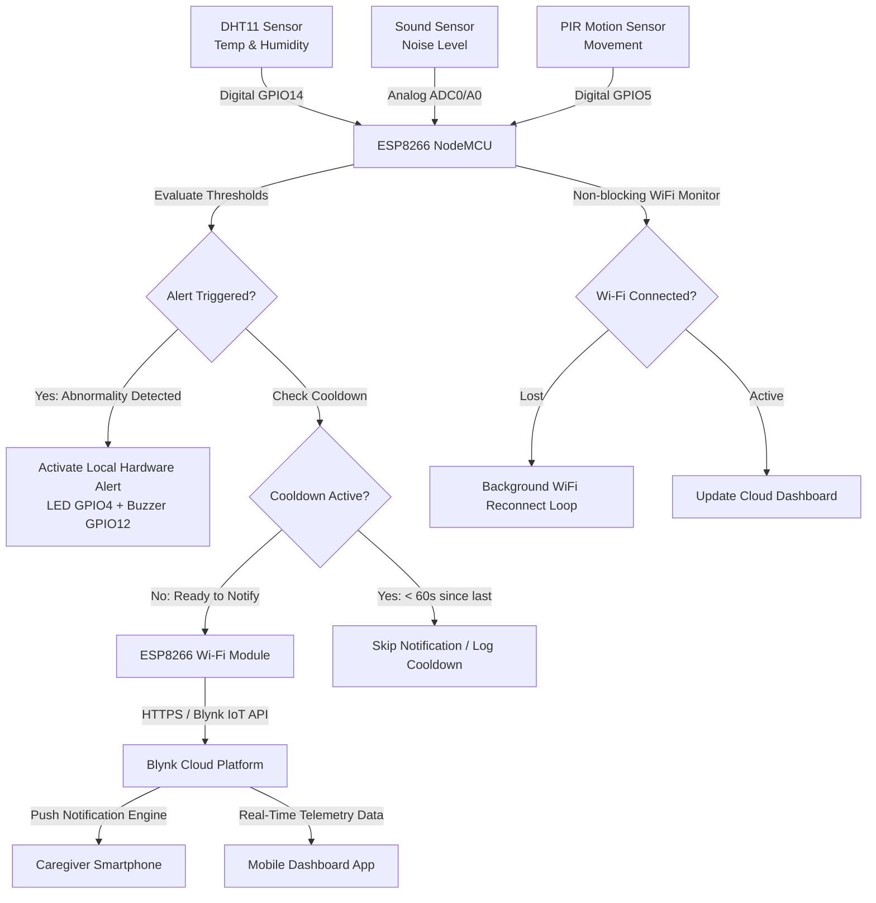

# 👶 ESP8266 IoT Baby Monitoring System with Mobile Wi-Fi Notifications

---

## 1. System Architecture

The ESP8266 IoT Baby Monitoring System operates on a multi-tier embedded architecture consisting of continuous physical sensing, edge threshold processing, Wi-Fi communication, cloud message distribution, and real-time mobile alerting.



### Architecture Steps:
1. **Sensor Acquisition Layer**: ESP8266 reads DHT11 (Temperature & Humidity), Analog Sound Sensor (Noise Level), and PIR Sensor (Motion) every 2 seconds.
2. **Edge Threshold & Cooldown Logic**: The code evaluates sensor values against configured safety limits. If an abnormal condition occurs, local indicators (LED & Buzzer) activate immediately.
3. **Notification Control Engine**: Before dispatching a mobile alert, the system verifies that the 60-second cooldown period has elapsed to prevent notification spam.
4. **Cloud / Mobile Relay Layer**: The ESP8266 transmits alerts over Wi-Fi to the Blynk Cloud IoT server via secure API protocol.
5. **Caregiver Interface**: The caregiver receives push notifications on their Android/iOS device and views live sensor trends on the mobile dashboard.

---

## 2. Required Hardware

| Quantity | Component Name | Description / Specification |
| :--- | :--- | :--- |
| 1 | **ESP8266 NodeMCU v1.0** | ESP-12E Wi-Fi Microcontroller Development Board |
| 1 | **DHT11 Sensor** | Temperature & Humidity Sensor Module (3-pin or 4-pin with 10k resistor) |
| 1 | **Analog Sound Sensor** | Microphone module with Analog Output (AO pin) |
| 1 | **PIR Motion Sensor** | HC-SR501 or Mini PIR Motion Detection Module |
| 1 | **5V Active Buzzer** | Local audio alert indicator |
| 1 | **5mm LED (Red)** | Status & warning indicator |
| 1 | **220Ω Resistor** | Current limiting resistor for LED |
| 1 | **Breadboard & Jumper Wires** | Full-sized breadboard and male-to-male / male-to-female jumper wires |
| 1 | **Micro-USB Cable** | High-quality USB cable for power and uploading code |
| 1 | **Smartphone** | Android or iOS connected to Internet / Wi-Fi |

---

## 3. Circuit / Pin Connections

> [!IMPORTANT]
> The ESP8266 operates on 3.3V logic. While the NodeMCU module has a built-in 3.3V regulator and 5V (VIN) pin, all sensor signal outputs connected to digital inputs (DHT11, PIR) are compatible with ESP8266 3.3V pins.

### Wiring Diagram Table

| Component | Pin on Component | ESP8266 NodeMCU Pin | GPIO Pin Number | Notes |
| :--- | :--- | :--- | :--- | :--- |
| **DHT11 Sensor** | VCC | 3.3V or 5V (VIN) | - | Power supply |
| | GND | GND | - | Ground |
| | DATA / OUT | **D5** | **GPIO 14** | Data line (pull-up internal/external) |
| **Sound Sensor** | VCC | 3.3V or 5V | - | Power supply |
| | GND | GND | - | Ground |
| | AO (Analog Out) | **A0** | **ADC0** | Analog noise measurement (0 - 1023) |
| **PIR Sensor** | VCC | 5V (VIN) or 3.3V | - | HC-SR501 works best with 5V |
| | GND | GND | - | Ground |
| | OUT | **D1** | **GPIO 5** | High signal on motion |
| **Status LED** | Anode (+) Long leg | **D2** via 220Ω | **GPIO 4** | Active HIGH warning LED |
| | Cathode (-) Short leg| GND | - | Ground connection |
| **Active Buzzer** | Positive (+ / VCC) | **D6** | **GPIO 12** | Active HIGH audio alert |
| | Negative (-) / GND | GND | - | Ground connection |

---

## 4. Required Arduino Libraries

To compile and run this project, install the following official libraries via the **Arduino IDE Library Manager**:

1. **`Blynk`** (by Volodymyr Shymanskyy): Connects ESP8266 to Blynk Cloud IoT app and handles push notifications.
2. **`DHT sensor library`** (by Adafruit): Interface library for DHT11/DHT22 temperature & humidity sensors.
3. **`Adafruit Unified Sensor`** (by Adafruit): Core dependency required by Adafruit DHT library.
4. **`ESP8266WiFi`** (Included in ESP8266 Arduino Core): Core Wi-Fi networking stack for ESP8266.

---

## 5. Cloud / Mobile Notification Service

### Service Choice: Blynk IoT Platform (Blynk 2.0)

For this system, **Blynk IoT** was selected as the cloud and mobile notification service.

#### Why Blynk IoT?
- **All-in-One Solution**: Combines real-time mobile telemetry dashboards (gauges, graphs, value displays) and instant mobile push notifications in one platform.
- **ESP8266 Native Compatibility**: Supported by lightweight, robust C++ libraries designed specifically for ESP8266.
- **Free Tier Available**: Provides templates, web dashboard, mobile app widgets, and event notification logs free of charge.
- **Cross-Platform**: Available on both Google Play Store (Android) and Apple App Store (iOS).

---

## 6. Complete Arduino Code

The full code file is saved as [`esp8266_baby_monitor.ino`](file:///C:/Users/LENOVO%20T495/OneDrive/Desktop/BABY%20MONITORING%20SYSTEM/esp8266_baby_monitor.ino).

```cpp
/*
  ================================================================================
  ESP8266 IoT Baby Monitoring System with Mobile Wi-Fi Notifications
  ================================================================================
  Author: Senior IoT & Embedded Systems Engineer
  Target Board: ESP8266 NodeMCU v1.0 (ESP-12E Module)
  ================================================================================
*/

#define BLYNK_TEMPLATE_ID   "TMPLxxxxxx"
#define BLYNK_TEMPLATE_NAME "Baby Monitor"
#define BLYNK_AUTH_TOKEN    "YOUR_BLYNK_AUTH_TOKEN"

#include <ESP8266WiFi.h>
#include <BlynkSimpleEsp8266.h>
#include <DHT.h>

// Wi-Fi Credentials
const char* WIFI_SSID     = "YOUR_WIFI_NAME";
const char* WIFI_PASSWORD = "YOUR_WIFI_PASSWORD";

// Hardware Pin Definitions
#define DHTPIN        14  // NodeMCU D5 (GPIO 14) - DHT11 Data Pin
#define DHTTYPE    DHT11  // Sensor type DHT11
#define PIR_PIN        5  // NodeMCU D1 (GPIO 5)  - PIR Motion Sensor Out
#define SOUND_PIN     A0  // NodeMCU A0 (ADC0)    - Analog Sound Sensor AO
#define LED_PIN        4  // NodeMCU D2 (GPIO 4)  - Status / Warning LED
#define BUZZER_PIN    12  // NodeMCU D6 (GPIO 12) - Local Alert Buzzer

// Safety Thresholds (Configurable example values)
float MAX_TEMPERATURE  = 30.0;  // Celsius threshold for high temperature alert
int SOUND_THRESHOLD    = 700;   // Analog reading (0 - 1023) sound threshold

// Timing & Cooldown Settings
const unsigned long SENSOR_READ_INTERVAL = 2000;   // Read sensors every 2s
const unsigned long NOTIFICATION_COOLDOWN = 60000; // 60s cooldown between push alerts

// System State Variables
float currentTemp       = 0.0;
float currentHumidity   = 0.0;
int currentSound        = 0;
bool currentMotion      = false;
bool isSystemNormal     = true;

unsigned long lastSensorReadTime  = 0;
unsigned long lastNotificationTime = 0;

DHT dht(DHTPIN, DHTTYPE);
BlynkTimer timer;

// Function Declarations
void connectToWiFi();
void reconnectWiFi();
void readSensors();
void checkTemperature();
void checkSound();
void checkMotion();
void evaluateSystemStatus();
void sendNotification(String eventCode, String alertMessage);
void updateDashboard();

void setup() {
  Serial.begin(115200);
  delay(100);
  Serial.println();
  Serial.println(F("=========================================="));
  Serial.println(F(" ESP8266 Infant Safety Monitoring System  "));
  Serial.println(F("=========================================="));

  pinMode(PIR_PIN, INPUT);
  pinMode(SOUND_PIN, INPUT);
  pinMode(LED_PIN, OUTPUT);
  pinMode(BUZZER_PIN, OUTPUT);

  digitalWrite(LED_PIN, LOW);
  digitalWrite(BUZZER_PIN, LOW);

  dht.begin();
  Serial.println(F("[DHT11] Sensor initialized successfully."));

  connectToWiFi();

  timer.setInterval(SENSOR_READ_INTERVAL, readSensors);
}

void loop() {
  reconnectWiFi();

  if (Blynk.connected()) {
    Blynk.run();
  }

  timer.run();
}

void connectToWiFi() {
  Serial.print(F("Connecting to WiFi: "));
  Serial.println(WIFI_SSID);

  WiFi.mode(WIFI_STA);
  WiFi.begin(WIFI_SSID, WIFI_PASSWORD);

  int attempts = 0;
  while (WiFi.status() != WL_CONNECTED && attempts < 20) {
    delay(500);
    Serial.print(F("."));
    attempts++;
  }

  if (WiFi.status() == WL_CONNECTED) {
    Serial.println();
    Serial.println(F("WiFi connected successfully!"));
    Serial.print(F("IP Address: "));
    Serial.println(WiFi.localIP());

    Blynk.config(BLYNK_AUTH_TOKEN);
    Blynk.connect(5000);
  } else {
    Serial.println();
    Serial.println(F("WiFi connection failed! Will retry in main loop..."));
  }
}

void reconnectWiFi() {
  static unsigned long lastReconnectAttempt = 0;
  unsigned long now = millis();

  if (WiFi.status() != WL_CONNECTED) {
    if (now - lastReconnectAttempt > 10000) {
      lastReconnectAttempt = now;
      Serial.println(F("[NETWORK] Wi-Fi lost! Attempting background reconnection..."));
      WiFi.disconnect();
      WiFi.begin(WIFI_SSID, WIFI_PASSWORD);
    }
  }
}

void readSensors() {
  float t = dht.readTemperature();
  float h = dht.readHumidity();

  if (isnan(t) || isnan(h)) {
    Serial.println(F("[WARNING] Failed to read from DHT11 sensor! Using previous values."));
  } else {
    currentTemp = t;
    currentHumidity = h;
  }

  currentSound = analogRead(SOUND_PIN);
  currentMotion = (digitalRead(PIR_PIN) == HIGH);

  Serial.println();
  Serial.println(F("--- Sensor Telemetry ---"));
  Serial.print(F("Temperature: ")); Serial.print(currentTemp, 1); Serial.println(F(" °C"));
  Serial.print(F("Humidity:    ")); Serial.print(currentHumidity, 1); Serial.println(F(" %"));
  Serial.print(F("Sound Level: ")); Serial.println(currentSound);
  Serial.print(F("Motion:      ")); Serial.println(currentMotion ? F("DETECTED") : F("NOT DETECTED"));
  Serial.print(F("Wi-Fi Status: ")); Serial.println(WiFi.status() == WL_CONNECTED ? F("CONNECTED") : F("DISCONNECTED"));

  checkTemperature();
  checkSound();
  checkMotion();

  evaluateSystemStatus();
  updateDashboard();
}

void checkTemperature() {
  if (currentTemp > MAX_TEMPERATURE) {
    Serial.println(F("WARNING: High temperature detected!"));
    
    String alertMsg = "⚠️ Baby Monitoring Alert:\nTemperature is above the configured threshold.\nCurrent temperature: " 
                      + String(currentTemp, 1) + " °C";
                      
    sendNotification("temp_alert", alertMsg);
  }
}

void checkSound() {
  if (currentSound > SOUND_THRESHOLD) {
    Serial.println(F("WARNING: High sound level detected!"));

    String alertMsg = "🔊 Baby Monitoring Alert:\nHigh sound detected.\nSound level: " 
                      + String(currentSound);

    sendNotification("sound_alert", alertMsg);
  }
}

void checkMotion() {
  if (currentMotion) {
    Serial.println(F("WARNING: Motion detected in crib area!"));

    String alertMsg = "🚶 Baby Monitoring Alert:\nMotion detected in the monitoring area.";

    sendNotification("motion_alert", alertMsg);
  }
}

void evaluateSystemStatus() {
  if (currentTemp > MAX_TEMPERATURE || currentSound > SOUND_THRESHOLD || currentMotion) {
    isSystemNormal = false;
    digitalWrite(LED_PIN, HIGH);
    digitalWrite(BUZZER_PIN, HIGH);
    Serial.println(F("System Status: ALERT / ABNORMAL"));
  } else {
    isSystemNormal = true;
    digitalWrite(LED_PIN, LOW);
    digitalWrite(BUZZER_PIN, LOW);
    Serial.println(F("System Status: NORMAL"));
  }
}

void sendNotification(String eventCode, String alertMessage) {
  unsigned long currentTime = millis();

  if (currentTime - lastNotificationTime >= NOTIFICATION_COOLDOWN || lastNotificationTime == 0) {
    lastNotificationTime = currentTime;

    Serial.println(F("Sending mobile notification..."));

    if (Blynk.connected()) {
      Blynk.logEvent(eventCode.c_str(), alertMessage);
      Serial.println(F("Notification sent successfully via Blynk!"));
    } else {
      Serial.println(F("[ERROR] Cannot send notification: Blynk disconnected!"));
    }
  } else {
    Serial.print(F("[COOLDOWN] Notification skipped to prevent spam. Time remaining: "));
    Serial.print((NOTIFICATION_COOLDOWN - (currentTime - lastNotificationTime)) / 1000);
    Serial.println(F(" s"));
  }
}

void updateDashboard() {
  if (!Blynk.connected()) return;

  Blynk.virtualWrite(V0, currentTemp);
  Blynk.virtualWrite(V1, currentHumidity);
  Blynk.virtualWrite(V2, currentSound);
  Blynk.virtualWrite(V3, currentMotion ? 1 : 0);
  Blynk.virtualWrite(V4, isSystemNormal ? "NORMAL" : "ALERT!");
  Blynk.virtualWrite(V5, WiFi.RSSI());
}
```

---

## 7. How the Code Works

1. **Modular Architecture**: The code avoids placing execution logic in `loop()`. Instead, it uses functions (`readSensors()`, `checkTemperature()`, `sendNotification()`, etc.) driven by `BlynkTimer`.
2. **Non-Blocking Timer Execution**: `BlynkTimer` executes `readSensors()` every 2000 milliseconds without using blocking calls like `delay()`.
3. **Sensor Processing**:
   - `DHT.readTemperature()` & `DHT.readHumidity()` collect ambient temperature and humidity. `isnan()` handles invalid readings gracefully.
   - `analogRead(SOUND_PIN)` converts microphonic acoustic signals to an integer range between `0` and `1023`.
   - `digitalRead(PIR_PIN)` returns `HIGH` when infrared thermal radiation movement is detected.
4. **Local Alert Activation**: If any threshold is breached, `evaluateSystemStatus()` turns ON the local LED and Buzzer instantly.
5. **Cooldown Anti-Spam Control**: `sendNotification()` calculates `currentTime - lastNotificationTime`. If less than 60,000ms (60 seconds) have elapsed since the last notification, it logs a cooldown skip message to the Serial Monitor rather than sending repeated push alerts.
6. **Wi-Fi Reconnection Engine**: `reconnectWiFi()` periodically checks `WiFi.status()`. If connection drops, it re-initiates background authentication without halting microcontroller execution.

---

## 8. How to Connect ESP8266 to Wi-Fi

1. Set your 2.4GHz Wi-Fi network name and password at the top of the sketch:
   ```cpp
   const char* WIFI_SSID     = "MyHomeWiFi";
   const char* WIFI_PASSWORD = "MySecurePassword123";
   ```
   *(Note: ESP8266 supports 2.4GHz Wi-Fi networks only, not 5GHz).*
2. The `connectToWiFi()` function configures the ESP8266 in Station Mode (`WiFi.mode(WIFI_STA)`), starts connection using `WiFi.begin()`, and prints progress dots to the Serial Monitor until connected.
3. If Wi-Fi disconnects during operation, `reconnectWiFi()` checks every 10 seconds and automatically reconnects in the background.

---

## 9. How to Connect ESP8266 to Mobile

```
[ESP8266 NodeMCU] --(Wi-Fi / Internet)--> [Blynk IoT Cloud] --(Push Notification & Data Stream)--> [Caregiver Smartphone App]
```

1. The ESP8266 establishes an encrypted TCP connection with the **Blynk Cloud Server** using your unique `BLYNK_AUTH_TOKEN`.
2. The **Blynk App** installed on the caregiver's smartphone connects to the same Blynk Cloud account.
3. Sensor readings pushed via `Blynk.virtualWrite()` instantly populate the mobile app UI.
4. Alerts triggered via `Blynk.logEvent()` cause the Blynk Cloud to deliver an instant OS push notification directly to the mobile phone screen.

---

## 10. How to Configure Mobile Notifications

1. Download **Blynk IoT** app from the App Store (iOS) or Google Play Store (Android).
2. Create a free Blynk account.
3. Open the **Blynk Web Console** (https://blynk.cloud/) on a PC:
   - Go to **Templates** -> Create **New Template** named `Baby Monitor` (Hardware: ESP8266, Connection: WiFi).
   - Go to **Events** tab -> Add 3 events:
     - Event Code: `temp_alert` | Title: Temperature Alert | Type: Warning | Enable **Send Push Notification to App**.
     - Event Code: `sound_alert` | Title: Sound Alert | Type: Warning | Enable **Send Push Notification to App**.
     - Event Code: `motion_alert` | Title: Motion Alert | Type: Warning | Enable **Send Push Notification to App**.
4. Go to **Devices** -> Add **New Device** from Template -> Copy your `BLYNK_TEMPLATE_ID`, `BLYNK_TEMPLATE_NAME`, and `BLYNK_AUTH_TOKEN`.
5. Paste these tokens into lines 14–16 of your Arduino sketch:
   ```cpp
   #define BLYNK_TEMPLATE_ID   "TMPLxxxxxx"
   #define BLYNK_TEMPLATE_NAME "Baby Monitor"
   #define BLYNK_AUTH_TOKEN    "YourActualAuthTokenHere"
   ```
6. Ensure notifications are enabled for the Blynk app in your phone's Operating System settings.

---

## 11. How to Configure Cloud Dashboard

In the **Blynk Web Console** or **Blynk Mobile App**, set up Datastreams and Visual Widgets:

### Datastream Configuration (Virtual Pins)

| Virtual Pin | Name | Data Type | Min | Max | Unit |
| :--- | :--- | :--- | :--- | :--- | :--- |
| **V0** | Temperature | Double / Float | -10 | 50 | °C |
| **V1** | Humidity | Double / Float | 0 | 100 | % |
| **V2** | Sound Level | Integer | 0 | 1023 | Raw ADC |
| **V3** | Motion State | Integer | 0 | 1 | 0=Clear, 1=Motion |
| **V4** | Alert Status | String | - | - | Text |
| **V5** | Wi-Fi Signal | Integer | -100 | 0 | dBm |

### Mobile Dashboard Layout
Add the following UI widgets to your mobile dashboard:
- **Gauge Widget** mapped to `V0` (Temperature)
- **Gauge Widget** mapped to `V1` (Humidity)
- **Value Display / Level Widget** mapped to `V2` (Sound Level)
- **LED / Icon Indicator Widget** mapped to `V3` (Motion Detected)
- **Labeled Value Widget** mapped to `V4` (System Alert Status)

---

## 12. How to Upload Using Arduino IDE

### Step 1: Install ESP8266 Board Package
1. Open Arduino IDE.
2. Go to **File** -> **Preferences**.
3. In *Additional Boards Manager URLs*, enter:
   `http://arduino.esp8266.com/stable/package_esp8266com_index.json`
4. Go to **Tools** -> **Board** -> **Boards Manager...**
5. Search for **ESP8266** and click **Install**.

### Step 2: Install Libraries
1. Go to **Sketch** -> **Include Library** -> **Manage Libraries...**
2. Search and install:
   - `Blynk`
   - `DHT sensor library`
   - `Adafruit Unified Sensor`

### Step 3: Select Board & Port
1. Connect NodeMCU to PC via Micro-USB cable.
2. Go to **Tools** -> **Board** -> **ESP8266 Boards** -> Select **NodeMCU 1.0 (ESP-12E Module)**.
3. Select your serial port under **Tools** -> **Port** (e.g., COM3 / COM4 on Windows).

### Step 4: Compile and Upload
1. Verify Wi-Fi and Blynk credentials in code.
2. Click the **Upload** button (Right Arrow icon) in Arduino IDE.
3. Open Serial Monitor (**Tools** -> **Serial Monitor**) and set baud rate to **115200 baud**.

---

## 13. Testing Procedure

### Test 1: Power-up & Serial Verification
1. Power up ESP8266.
2. Verify Serial output displays:
   ```text
   ==========================================
    ESP8266 Infant Safety Monitoring System  
   ==========================================
   [DHT11] Sensor initialized successfully.
   Connecting to WiFi: MyHomeWiFi
   .....
   WiFi connected successfully!
   IP Address: 192.168.1.105
   ```

### Test 2: Normal Telemetry Verification
1. Check Serial Monitor for telemetry logs every 2s:
   ```text
   --- Sensor Telemetry ---
   Temperature: 24.5 °C
   Humidity:    55.0 %
   Sound Level: 210
   Motion:      NOT DETECTED
   Wi-Fi Status: CONNECTED
   System Status: NORMAL
   ```
2. Check Mobile Dashboard to confirm gauges for temperature, humidity, and sound reflect live values.

### Test 3: Motion Alert Test
1. Wave your hand in front of the PIR motion sensor.
2. Verify:
   - Serial Monitor prints: `WARNING: Motion detected in crib area!`
   - Local LED and Buzzer turn ON.
   - Caregiver smartphone receives push notification: `🚶 Baby Monitoring Alert: Motion detected in the monitoring area.`

### Test 4: High Sound Alert Test
1. Clap loudly near the sound sensor microphone.
2. Verify sound reading exceeds `SOUND_THRESHOLD` (700) and triggers alert notification.

### Test 5: Cooldown Verification
1. Keep triggering the sound sensor within 60 seconds.
2. Verify Serial Monitor prints: `[COOLDOWN] Notification skipped to prevent spam.` No secondary phone alert is sent until 60 seconds pass.

---

## 14. Troubleshooting & Calibration Reference

For extended sensor calibration instructions, analog gain tuning, pull-up resistor setups, and EEPROM diagnostic resets, refer to the dedicated guide:
- 🛠️ [Hardware Calibration & Troubleshooting Guide](docs/TROUBLESHOOTING_AND_CALIBRATION.md)

| Issue / Error | Cause | Solution |
| :--- | :--- | :--- |
| `[WARNING] Failed to read from DHT11` | Wiring loose or incorrect pin | Check signal pin connected to D5 (GPIO14). Add a 10kΩ pull-up resistor between VCC and DATA if using raw 4-pin DHT11. |
| `WiFi connection failed!` | Incorrect SSID/password or 5GHz Wi-Fi | Verify credentials. Ensure ESP8266 is connecting to a 2.4GHz network. |
| `Blynk disconnected!` | Invalid Auth Token or Template ID | Copy BLYNK_TEMPLATE_ID, BLYNK_TEMPLATE_NAME, and BLYNK_AUTH_TOKEN directly from Blynk Console. |
| PIR false triggers | Sensitivity set too high | Adjust the orange sensitivity potentiometer on the PIR module counter-clockwise. |
| Sound sensor always HIGH/LOW | Potentiometer threshold misaligned | Adjust the blue potentiometer on the sound sensor module to calibrate noise sensitivity. |
| ESP8266 continuous resets / WDT reset | Heavy blocking code in `loop()` | Do not add `delay()` calls inside `loop()`. Keep `BlynkTimer` running smoothly. |

---

## 15. Possible Future Improvements

1. **Camera Stream Integration**: Integrate an ESP32-CAM module to provide real-time video streaming alongside sensor metrics.
2. **Infant Breathing / Wearable Pulse Oximeter**: Add MAX30102 pulse oximetry sensor to monitor heart rate and SpO2 levels continuously.
3. **Two-Way Audio Lullaby Player**: Add an SD card module + LM386 amplifier to trigger soothing lullabies automatically when crying is detected.
4. **Local OLED Display**: Add a 0.96" I2C OLED display directly on the monitoring box for quick bedside diagnostics without opening the mobile app.
5. **Battery Backup & UPS**: Add a 18650 Li-ion battery charging circuit (TP4056) to ensure continuous monitoring during home power outages.
